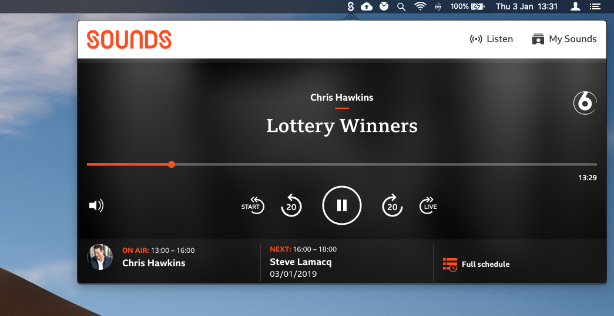

## Sounds - BBC Sounds status bar App for macOS

See [Building a BBC Sounds status bar app for macOS](https://www.richt.co.uk/articles/building-bbc-sounds-app-for-macos/) for
the story behind this project.

## Running locally

* Install XCode from the App Store if you don't already have it
* Open the `Sounds.xcodeproj` project file in xcode
* Product -> Archive -> Distribute App -> Custom -> Copy App (This creates a folder with the application file in it)
* Copy the app into your application folder and you are good to go!
